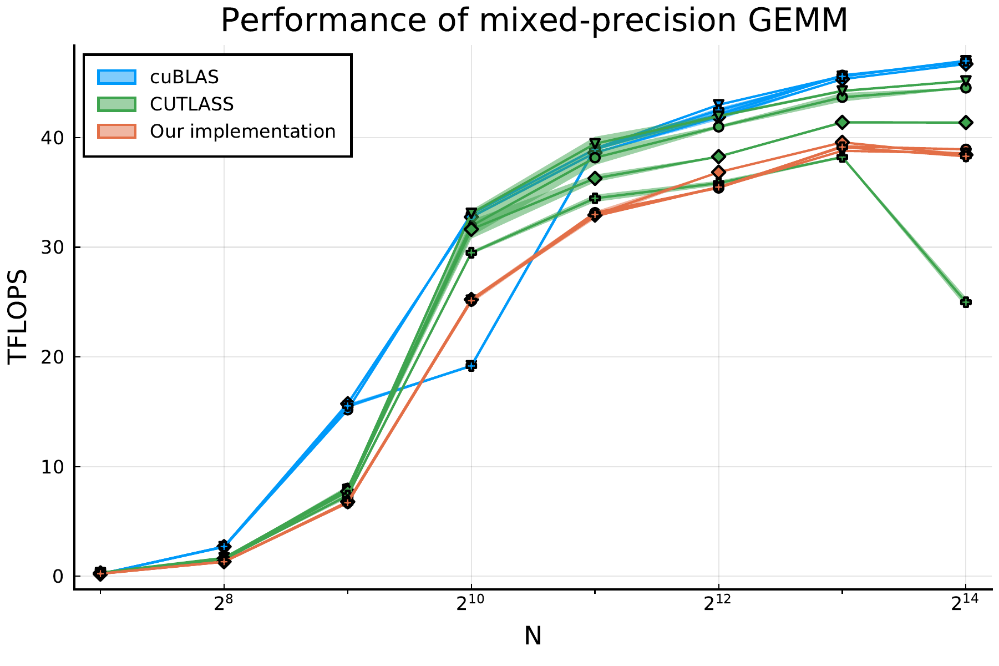

# GemmKernels

_Flexible and performant GEMM kernels in Julia_

[![][doi-img]][doi-url] [![][buildkite-img]][buildkite-url] [![][codecov-img]][codecov-url]

[buildkite-img]: https://badge.buildkite.com/92f2ead968bafc516afa354576cccb7ab2f5b42a272d9cb0f0.svg?branch=master
[buildkite-url]: https://buildkite.com/julialang/gemmkernels-dot-jl

[codecov-img]: https://codecov.io/gh/JuliaGPU/GemmKernels.jl/branch/master/graph/badge.svg
[codecov-url]: https://codecov.io/gh/JuliaGPU/GemmKernels.jl

[doi-img]: https://zenodo.org/badge/doi/10.1109/TPDS.2021.3136457.svg
[doi-url]: https://ieeexplore.ieee.org/document/9655458

This package contains a framework to instantiate flexible, performant GEMM (General Matrix
Multiplication) kernels. You can use this framework to define your own GEMM kernels, or use
one of the predefined interfaces that this package also provides.


## Quick start

The package can be installed using Julia's built-in package manager.
Open the Julia REPL, type `]` to enter Pkg-mode, and run:

```julia
pkg> add GemmKernels
```

Most people will be interested in the BLAS-like interface that is available as
`GemmKernels.mul!`:

```julia
julia> using GemmKernels, CUDA

julia> A = CUDA.rand(2048, 2048)
julia> B = CUDA.rand(2048, 2048)
julia> C = CUDA.zeros(2048, 2048)

julia> GemmKernels.mul!(C, A, B)
```

For more control, e.g. to use optimized layouts, or fuse the multiplication with a bias, you
need to use the low-level `GemmKernels.matmul` interface (see the `examples` directory).


## Performance

The kernels in this package are expected to deliver around 50% to 80% of the performance of
the state-of-the-art libraries like cuBLAS and CUTLASS. The exact performance depends on the
specific invocation (e.g. the size of the matrices, the data type, etc.), and the GPU
architecture.

For example, on an NVIDIA RTX 2080 Ti, we can achieve competitive performance for a
mixed-precision multiplication of FP16 inputs and FP32 output:




## Framework

The GEMM kernels above are implemented using a framework that decomposes GEMM kernels into
orthogonal components:

- _Params_ determine the tiling size and launch configuration of the GEMM kernel. The tiling
  sizes are specified in _logical_ coordinates, i.e. with a meaning specified by the user.
- _Layouts_ convert the logical coordinates of tiles to physical offsets in memory.
- _Transforms_ are used to apply any arbitrary Julia functor to the GEMM's inputs or
  outputs. They are applied after every load, and before every store.
- _Operators_ are responsible to perform the matrix multiplication itself. They load tiles
  from shared memory, perform the matrix multiplication, and store the resultant tile back
  to shared memory.
- _Epilogues_ copy tiles of the resultant matrix to global memory, and can be used to
  implement arbitrary post-processing, such as adding a bias vector to the resultant matrix.

Each of these components corresponds to a set of functions with a predetermined interface.
These functions can be customised by the user through Julia's multiple dispatch
functionality.

The package currently provides two main operators, both of which for NVIDIA GPUs:
- `WMMAOperator`: for using Tensor cores through the WMMA APIs;
- `FPUOperator`: for other data types or input sizes.

Optimized layouts are available for diagonal matrices and matrices of complex/dual numbers.


## Citation

For more details on the implementation and performance results, please see our accompanying
[paper][ieee-paper] (pre-print available on [arXiv][arxiv-paper]). The
[`CITATION.bib`](CITATION.bib) file in the root of this repository contains a citation in
BibTeX format.

[ieee-paper]: https://ieeexplore.ieee.org/document/9655458
[arxiv-paper]: https://arxiv.org/abs/2009.12263
